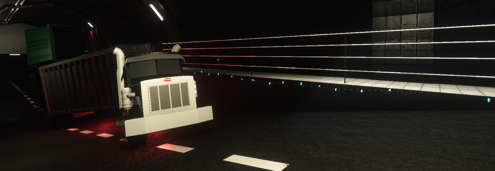

# SCP-1423

<figure><figcaption></figcaption></figure>

SCP-1423 доставлялись в комплекс \[ДАННЫЕ ПОВРЕЖДЕНЫ] для хранение и изучения. Но   из-за аномалии \[ДНАННЫЕ УДАЛЕНЫ] грузовик был повреждён выведен из строя. В результате этого инцидента, всё SCP-1423 разбежались по территории комплекса.

<figure><figcaption></figcaption></figure>

Так же этот грузовик перевозил животных для эксперимента \[ДАННЫЕ УДАЛЕНЫ].

<figure><figcaption></figcaption></figure>

 

<figure><figcaption></figcaption></figure>

