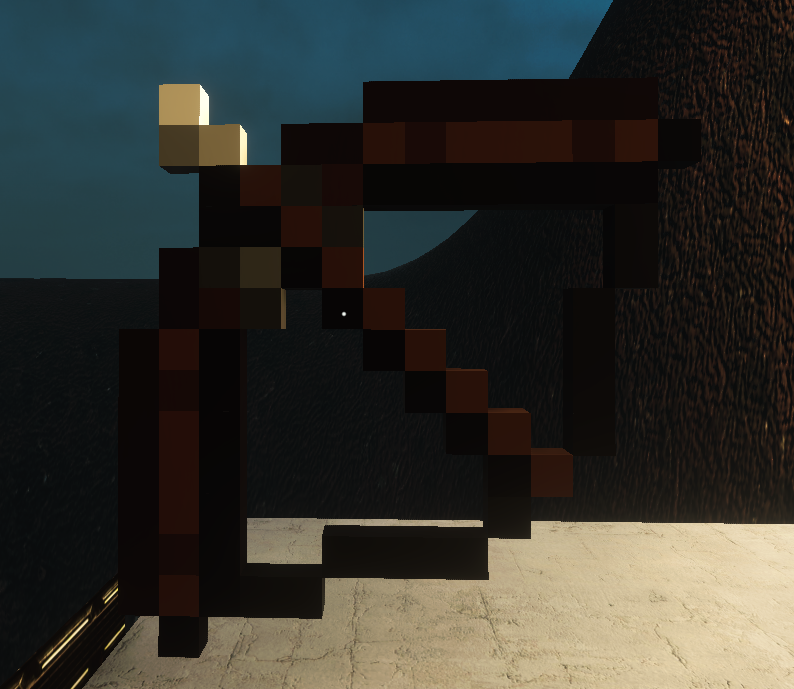

# SCP-143

<figure><figcaption></figcaption></figure>

SCP-143 представляет собой обычный лук времен \*\*\*\* по \*\*\*\*. Сам по себе лук крепкий и его стрелы тоже, не было в данный момент способов уничтожить их. Аномальная способность SCP-143 заключается в том, что субъект выстрельнувший из SCP-143 с помощью стрелы (далее обозначаемой SCP-143-1), попадёт в тот предмет, в который он стрельнул. Это может быть как игрушка, так и оружие и пол. Исключение: это предметы которые нематериальны и стены. При этом тело будет стоять в такой положении в котором оно стрельнуло SCP-143-1. "Душа" субъекта попадёт опять же в тот предмет. Эффект пройдёт через 5 минут. Предметы также можно будет уничтожить, при этом субъект будет чувствовать боль.
