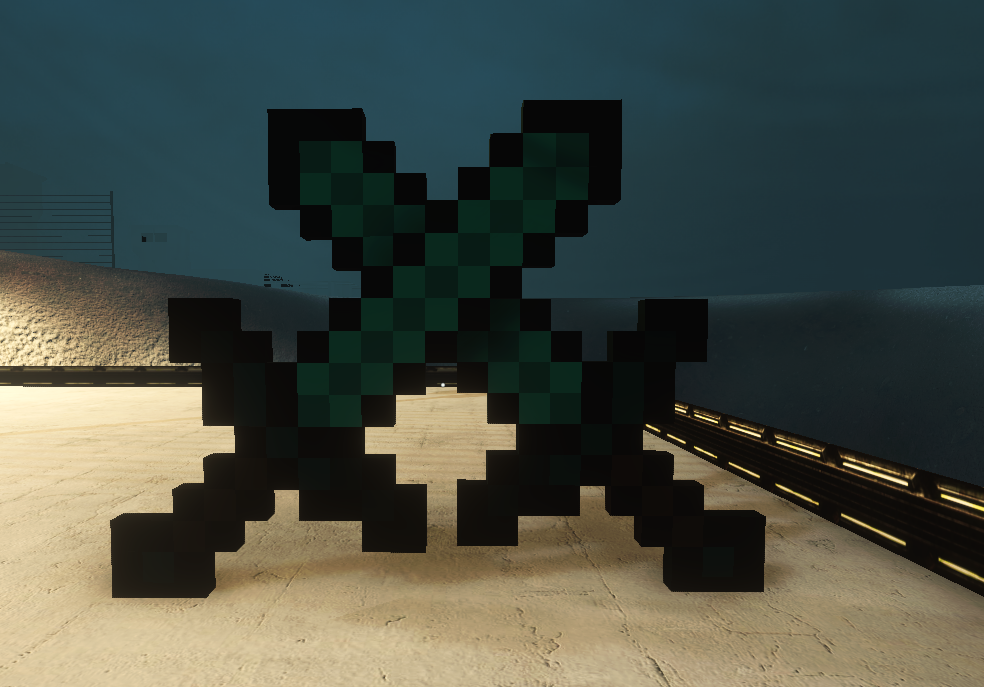

# SCP-6572

<figure><figcaption></figcaption></figure>

 

<figure><figcaption></figcaption></figure>

 

<figure><figcaption></figcaption></figure>

SCP-6572 представляет собой мечи, которым приписывается способность к разрезанию любой материи. На мечи не влияет сила трения, они не поддаётся воздействию высоких температур и давления.

Упоминания SCP-6572 до постановки на содержание отсутствуют. Не принесло результатов также сравнение характеристик SCP-6572 с мечами, ранее находившимися во владении "Маршалл, Картер и Дарк".
